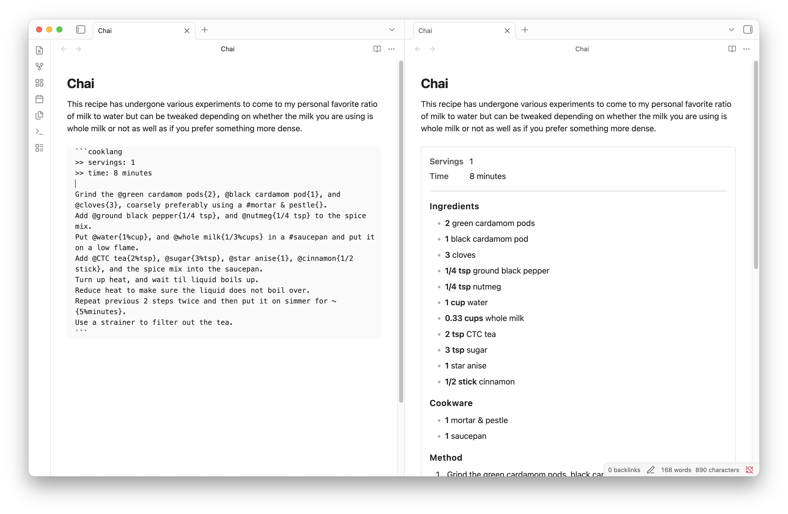

# Obsidian cooklang block plugin

This plugin enables embedding recipes written in [cooklang](https://cooklang.org) within an Obsidian note. In view mode, the block renders the recipe with its corresponding ingredients, cookware, and method. The recipe can also optionally render meta information such as cook time, and serving size at the top of the block.

